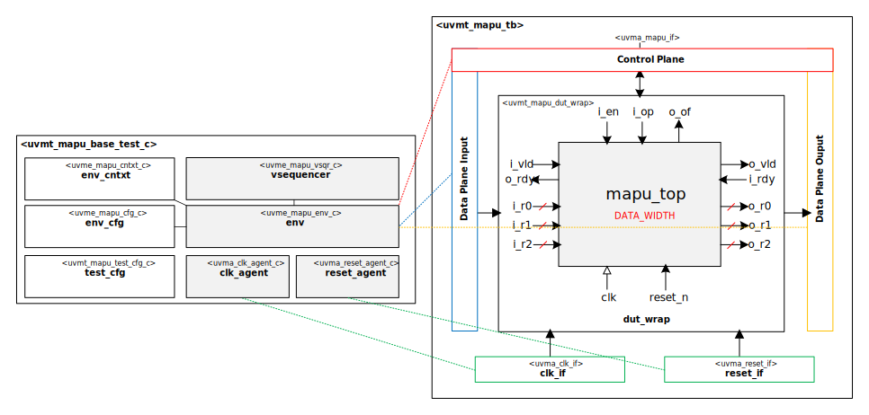

# [Moore.io Demo Project](https://github.com/Datum-Technology-Corporation/mio_demo) - Part 2 - Start
Copyright 2023 [Datum Technology Corporation](https://datumtc.ca/)

## About
|  | Executive Summary |
|-|-|
|  | The [Moore.io](https://www.mooreio.com/) Demo project demonstrates the power of the [Moore.io CLI](https://mooreio-client.readthedocs.io/en/latest/commands.html) and [UVMx Template System](https://mooreio-client.readthedocs.io/en/latest/code_templates.html).  Both are described thoroughly in the [Moore.io CLI User Manual](https://mooreio-client.readthedocs.io/en/latest/index.html).  This demo series is broken into several Parts: this branch (`p2_start`) contains only the 3x3 Integer Matrix APU RTL IP.  The branch [`p2_end`](https://github.com/Datum-Technology-Corporation/mio_demo/tree/p2_end) contains the 'solution' for those playing along.  The [video](https://www.youtube.com/channel/UCSqqT6JtmecBIoC_3DMLk0g) for this Part is available on [Datum's YouTube Channel](https://www.youtube.com/channel/UCSqqT6JtmecBIoC_3DMLk0g).

The entire demo video series is available on [YouTube](https://www.youtube.com/channel/UCSqqT6JtmecBIoC_3DMLk0g).

# Contents

