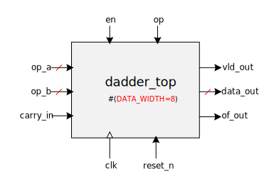

# [Moore.io](https://www.mooreio.com/) Demo Project

## About
|  | Executive Summary |
|-|-|
|  | The [Moore.io](https://www.mooreio.com/) Demo project demonstrates the power of the Moore.io [CLI](https://mooreio-client.readthedocs.io/en/latest/commands.html) and [UVM Template System](https://mooreio-client.readthedocs.io/en/latest/code_templates.html).  Both are described thoroughly in the [Moore.io CLI User Manual](https://mooreio-client.readthedocs.io/en/latest/index.html).  This branch (`main`) is the starting point, other branches are 'solutions' to the chapters of this demo series. |

### Device Under Test
For this demo series, the DUT, [`dadder`](./rtl/dadder), is a full adder/subtracter in RTL form.  It does **NOT** use 1 or 2's complement.

## [Chapter 1 - Workstation Setup](https://www.youtube.com/channel/UCSqqT6JtmecBIoC_3DMLk0g)
The first chapter deals with setting up a linux machine for UVM simulation using `mio` and [Xilinx® Vivado™ ML Edition](https://www.xilinx.com/support/download/index.html/content/xilinx/en/downloadNav/vivado-design-tools.html)

## [Chapter 2 - Verifying an RTL Block using UVM & Moore.io](https://www.youtube.com/channel/UCSqqT6JtmecBIoC_3DMLk0g)
The second entry generates several IPs in one command and uses the resulting [UVM Block-Level Test Bench](https://mooreio-client.readthedocs.io/en/latest/code_templates.html#block-test-bench) to fully verify the [`dadder` RTL IP](./rtl/dadder) that ships with this branch using constrained-random stimulus, scoreboarding and functional coverage.

Solution Branch: [`block_tb`](https://github.com/Datum-Technology-Corporation/mio_demo/tree/block_tb)

## Chapter 3 - Verifying an APB Sub-System using UVM & Moore.io
**Coming soon**

The third chapter builds on the last to verify a Sub-System of 2 `dadder_top` instances connected to an APB interconnect and a register map. This is achieved via the [Moore.io Sub-System UVM Test Bench Generator](https://mooreio-client.readthedocs.io/en/latest/code_templates.html#sub-system-test-bench) and the [Datum APB UVM Agent](https://www.mooreio.com/catalog/1158).
