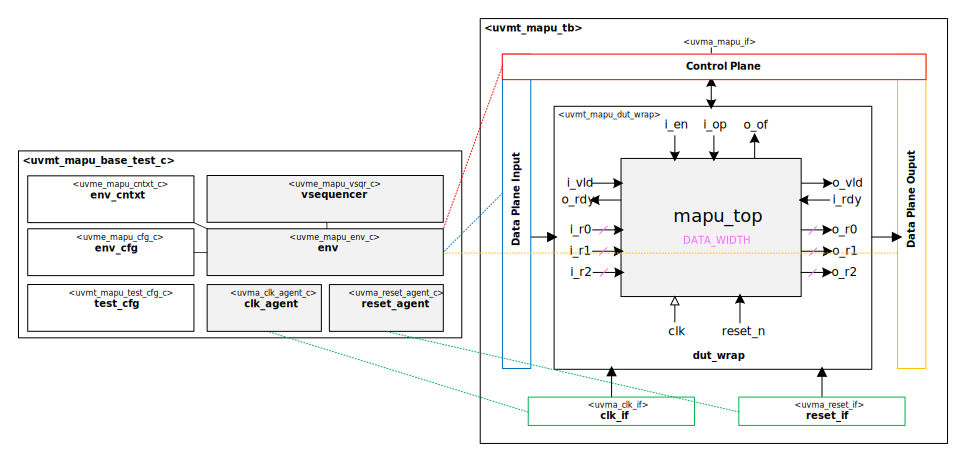

# [Moore.io Demo Project](https://github.com/Datum-Technology-Corporation/mio_demo) - [Part 2 - Block design UVM verification]()
Copyright 2023 [Datum Technology Corporation](https://datumtc.ca/)

## Summary
Verify a matrix APU by starting with a pin list in a spreadsheet and finishing with a set of constrained-random regressions with prediction, scoreboarding and self-checking tests.

This demo series is broken into several parts: this branch (`p2_start`) contains the instructions and [`p2_end`](https://github.com/Datum-Technology-Corporation/mio_demo/tree/p2_end) is the 'solution' branch.  The entire demo video series is available on [YouTube](https://www.youtube.com/channel/UCSqqT6JtmecBIoC_3DMLk0g).

