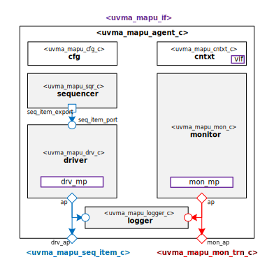

# Acme Matrix APU UVM Agent

# About
This package contains the Acme Matrix APU UVM Agent.
TODO Describe Matrix APU

# Block Diagram

# Directory Structure
* `bin` - Scripts, metadata and other miscellaneous files
* `docs` - Reference documentation
* `examples` - Code samples for using and extending this agent
* `src` - Source code

# Dependencies
It is dependent on the following packages:

* `uvm_pkg`
* `uvml_pkg`
* `uvml_logs_pkg`
