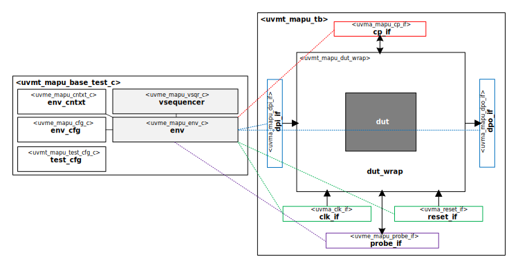

# Acme Matrix APU Block UVM Test Bench

# About
This IP contains the Acme Matrix APU Block UVM Test Bench.

TODO Describe Matrix APU

# Block Diagram

# Directory Structure
* `bin` - Scripts, metadata and other miscellaneous files
* `docs` - Reference documentation
* `examples` - Code samples for adding to this test bench
* `src` - Source code

# Dependencies
It is dependent on the following IP:

* `uvm`
* `uvml`
* `uvml_logs`
* `uvml_sb`
* `uvml_ral`
* `uvma_clk`
* `uvma_reset`
* `uvma_mapu_cp`
* `uvma_mapu_dpi`
* `uvma_mapu_dpo`
* `uvme_mapu`
