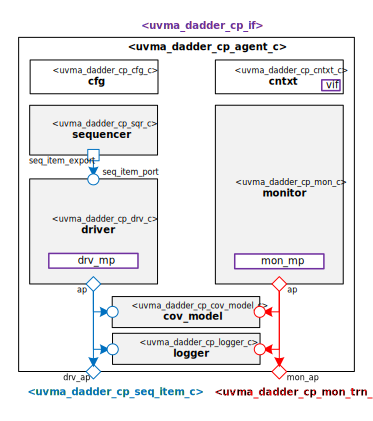

# Hello from your Code Generator!
Thank you for using the Moore.io Block-Level UVM Agents+Environment+TB Code Template v1.0!

Your parameters are:
* Name: 'dadder_cp'
* Full Name: 'Decimal adder/subtracter Block Control Plane'

If this is incorrect, it is recommended to delete the generated IP and re-generate with the correct parameters.

What follows is a short guide for developers of this new UVM Agent. You may also use `grep -nr TODO .` for a full list.

 1. - [x] Physical Interface - `uvma_dadder_cp_if.sv` - Modify the signals to match your protocol's physical interface.
 1. - [x] Monitor Transaction - `obj/uvma_dadder_cp_mon_trn.sv` - Modify the fields to match your interface definition.
 1. - [x] Sequence Item - `seq/uvma_dadder_cp_seq_item.sv` - Modify the fields to match your interface definition.
 1. - [x] Driver - `comps/uvma_dadder_cp_drv.sv` - Modify the code driving the modport signals to match your interface definition.
 1. - [x] Monitor - `comps/uvma_dadder_cp_mon.sv` - Modify the code sampling the modport signals to match your interface definition.

## Have fun!
Make sure to check out the other IP generated along with this test bench:
* `uvma_dadder_cp_cp`
* `uvma_dadder_cp_dp_in`
* `uvma_dadder_cp_dp_out`
* `uvme_dadder_cp`
* `uvmt_dadder_cp`

# Decimal adder/subtracter Block Control Plane UVM Agent

# About
This package contains the Decimal adder/subtracter Block Control Plane UVM Agent.

# Block Diagram

# Directory Structure
* `bin` - Scripts, metadata and other miscellaneous files
* `docs` - Reference documentation
* `examples` - Code samples for using and extending this agent
* `src` - Source code

# Dependencies
It is dependent on the following packages:

* `uvm_pkg`
* `uvml_pkg`
* `uvml_logs_pkg`