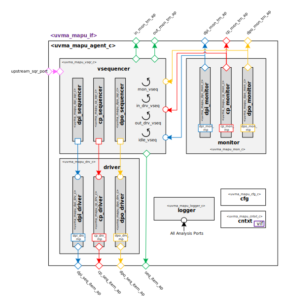

# Hello from your Code Generator!
Thank you for using the Moore.io Block-Level UVM Agents+Environment+TB Code Template v1.0!

Your parameters are:
* Name: 'mapu'
* Full Name: 'Matrix APU'

If this is incorrect, it is recommended to delete the generated IP and re-generate with the correct parameters.

What follows is a short guide for developers of this new UVM Agent. You may also use `grep -nr TODO .` for a full list.

 1. - [ ] Macros - `src/uvma_mapu_macros.svh` - Add any constants needed for the physical interface.
 1. - [ ] Physical Interface - `src/uvma_mapu_if.sv` - Modify the signals to match your protocol's physical interface.
 1. - [ ] Constants - `src/uvma_mapu_contants.sv` - Add any constants needed for the agent classes.
 1. - [ ] Typedefs - `src/uvma_mapu_tdefs.sv` - Add any enums/structs/unions needed for the agent classes.
 1. - [ ] Monitor Transaction - `src/obj/uvma_mapu_mon_trn.sv` - Modify the fields to match your interface definition.
 1. - [ ] Sequence Item - `src/seq/uvma_mapu_seq_item.sv` - Modify the fields to match your interface definition.
 1. - [ ] Driver - `src/comps/uvma_mapu_drv.sv` - Modify the code driving the modport signals to match your interface definition.
 1. - [ ] Monitor - `src/comps/uvma_mapu_mon.sv` - Modify the code sampling the modport signals to match your interface definition.

## Have fun!
Make sure to check out the other IP generated along with this test bench.

# Acme Matrix APU UVM Agent

# About
This package contains the Acme Matrix APU UVM Agent.
TODO Describe Matrix APU

# Block Diagram

# Directory Structure
* `bin` - Scripts, metadata and other miscellaneous files
* `docs` - Reference documentation
* `examples` - Code samples for using and extending this agent
* `src` - Source code

# Dependencies
It is dependent on the following packages:

* `uvm_pkg`
* `uvml_pkg`
* `uvml_logs_pkg`