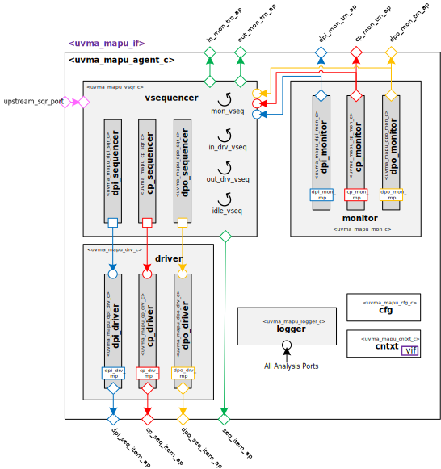

# Acme Matrix APU Block UVM Agent

## About
This package contains the Acme Matrix APU Block UVM Agent.

## Block Diagram

## Directory Structure
* `bin` - Scripts, metadata and other miscellaneous files
* `docs` - Reference documentation
* `examples` - Code samples for using and adding to this agent
* `src` - Source code root

> * `comps` - UVM Components
> * `obj` - UVM Objects and Monitor Transactions
> * `seq` - UVM Sequences and Sequence Items

## Dependencies
It is dependent on the following IP:

* [uvmx](https://www.mooreio.com/catalog/1152)