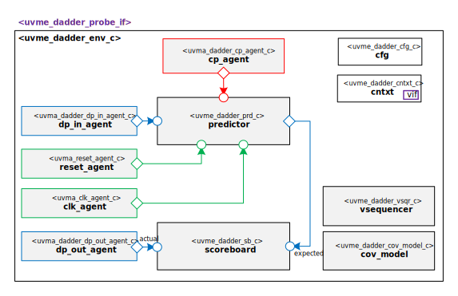

# Hello from your Code Generator!
Thank you for using the Moore.io Block-Level UVM Agents+Environment+TB Code Template v1.0!

Your parameters are:
* Name: 'dadder'
* Full Name: 'Decimal adder/subtracter'

If this is incorrect, it is recommended to delete the generated IP and re-generate with the correct parameters.

This code template assumes the DUT has a single datapath (DP) direction and control plane (CP) signals.

What follows is a short guide for developers of this new UVM Environment.  You may also use `grep -nr TODO .` for a full list.

## 1 - Connect the DUT to the Interfaces
1. - [x] Predictor - `comps/uvma_dadder_prd.sv` - Use the sample code as a guide to convert input DP transactions into output DP transactions.
2. - [x] Scoreboard Logs - `obj/uvme_dadder_cfg_c` - Add Monitor Transaction metadata to scoreboard logs by following the examples.
3. - [x] Functional Coverage Model - `comps/uvma_dadder_cov_model.sv` - Use the sample code as a guide to implement the functional coverage model for your block.

## Have fun!
Make sure to check out the other IP generated along with this test bench.

# Decimal adder/subtracter Block UVM Environment

# About
This IP contains the Decimal adder/subtracter Block UVM Environment.

# Block Diagram

# Directory Structure
* `bin` - Scripts, metadata and other miscellaneous files
* `docs` - Reference documentation
* `examples` - Code samples for using and extending this environment
* `src` - Source code

# Dependencies
It is dependent on the following IP:

* `uvm`
* `uvml`
* `uvml_logs`
* `uvml_sb`
* `uvml_ral`
* `uvma_clk`
* `uvma_reset`
* `uvma_dadder_cp`
* `uvma_dadder_dp_in`
* `uvma_dadder_dp_out`