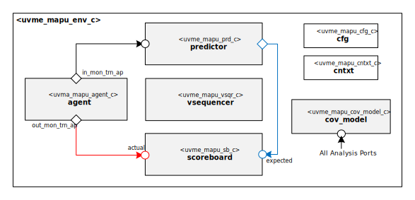

# Hello from your Code Generator!
Thank you for using the Moore.io Block-Level UVM Agents+Environment+TB Code Template v1.0!

Your parameters are:
* Name: 'mapu'
* Full Name: 'Matrix APU'

If this is incorrect, it is recommended to delete the generated IP and re-generate with the correct parameters.

This code template assumes the DUT has a single datapath (DP) direction and control plane (CP) signals.

What follows is a short guide for developers of this new UVM Environment.  You may also use `grep -nr TODO .` for a full list.

## 1 - Connect the DUT to the Interfaces
 1. - [ ] Macros - `src/uvme_mapu_macros.svh` - Add any constants needed for the Probe Interface.
 1. - [ ] Probe Interface - `src/uvme_mapu_probe_if.sv` - Add any additional signals needed by Virtual Sequences.
 1. - [ ] Constants - `src/uvme_mapu_constants.sv` - Add any constants needed for the Environment classes.
 1. - [ ] Typedefs - `src/obj/uvme_mapu_tdefs.sv` - Add any enums/structs/unions needed for the Environment classes.
 1. - [ ] Configuration - `src/obj/uvme_mapu_cfg.sv` - Add knobs if needed and sync up the agents' configurations.
 1. - [ ] Context - `src/obj/uvme_mapu_cntxt.sv` - Add state variables needed by the Predictor and Virtual Sequences.
 1. - [ ] Fixed Stimulus Virtual Sequence - `src/seq/uvme_mapu_fixed_stim_vseq.sv` - Modify the sample stimulus if needed to form valid fixed (i.e. directed) stimulus for your Design Block.
 1. - [ ] Checker - `src/uvme_mapu_chkr.sv` - Add assertions (if needed) to the Checker Module.  The latter needs to be bound in the test bench this environment is used in.
 1. - [ ] Predictor - `src/comps/uvme_mapu_prd.sv` - Use the sample code as a guide to convert input DP transactions into output DP transactions.
 1. - [ ] Scoreboard Logs - `src/obj/uvme_mapu_cfg_c` - Add Monitor Transaction metadata to scoreboard logs by following the examples.
 1. - [ ] Random Stimulus Virtual Sequence - `src/seq/uvme_mapu_rand_stim_vseq.sv` - Modify the sample stimulus if needed to form valid constrained-random stimulus for your Design Block.
 1. - [ ] Functional Coverage Model - `src/comps/uvme_mapu_cov_model.sv` - Use the sample code as a guide to implement the Functional Coverage model for your Design block.
 1. - [ ] Fixed Illegal Stimulus Virtual Sequence - `src/seq/uvme_mapu_fixed_ill_stim_vseq.sv` - Modify the sample stimulus if needed to form fixed valid/illegal stimulus for your Design Block.
 1. - [ ] Random Illegal Stimulus Virtual Sequence - `src/seq/uvme_mapu_rand_ill_stim_vseq.sv` - Modify the sample stimulus if needed to form constrained-random valid/illegal stimulus for your Design Block.

## Have fun!
Make sure to check out the other IP generated along with this test bench:
* `uvma_mapu_cp`
* `uvma_mapu_dpi`
* `uvma_mapu_dpo`
* `uvmt_mapu`

# Acme Matrix APU Block UVM Environment

# About
This IP contains the Acme Matrix APU Block UVM Environment.

TODO Describe Matrix APU

# Block Diagram

# Directory Structure
* `bin` - Scripts, metadata and other miscellaneous files
* `docs` - Reference documentation
* `examples` - Code samples for using and extending this environment
* `src` - Source code

# Dependencies
It is dependent on the following IP:

* `uvm`
* `uvml`
* `uvml_logs`
* `uvml_sb`
* `uvml_ral`
* `uvma_clk`
* `uvma_reset`
* `uvma_mapu_cp`
* `uvma_mapu_dpi`
* `uvma_mapu_dpo`