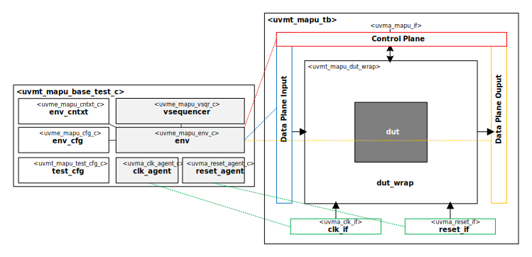

# Hello from your Code Generator!
Thank you for using the Moore.io Block-Level UVM Agents+Environment+TB Code Template v1.0!

Your parameters are:
* Name: 'mapu'
* Full Name: 'Matrix APU'
* DUT IP Vendor: 'Acme'
* DUT IP Name: 'mapu'
* DUT IP Type: 'mio'

If this is incorrect, it is recommended to delete the generated IP and re-generate with the correct parameters.

This code template assumes the DUT has a single datapath (DP) direction and control plane (CP) signals.

What follows is a short guide for developers of this new UVM Test Bench.  You may also use `grep -nr TODO .` for a full list.

## 1. - Physical Interface
 1. - [ ] DUT Wrapper - `src/tb/uvmt_mapu_dut_wrap.sv` - Check clocking and reset signals.

## 2. - Fixed stimulus
 1. - [ ] Base Test Workaround Constraints - `src/tests/uvmt_mapu_base_test_workarounds.sv` - Remove line disabling scoreboarding.
 2. - [ ] Fixed Stimulus Test - `src/tests/uvmt_mapu_fixed_stim_test.sv` - Uncomment constraint rule to enable scoreboarding.  Run and debug.

## 3. - Random stimulus and Regressions
 1. - [ ] Random Stimulus Test - `src/tests/uvmt_mapu_rand_stim_test.sv` - Uncomment constraint rule to enable scoreboarding.  Run and debug.
 2. - [ ] Review and run Test Suite - `src/tests/ts.yml` - Ensure that specified regressions are correct.  Run and debug.

## 4. - Error testing
 1. - [ ] Fixed Illegal Stimulus Test - `src/tests/uvmt_mapu_fixed_ill_stim_test.sv` - Uncomment constraint rule to enable scoreboarding.  Run and debug.
 2. - [ ] Random Illegal Stimulus Test - `src/tests/uvmt_mapu_rand_ill_stim_test.sv` - Uncomment constraint rule to enable scoreboarding.  Run and debug.
 3. - [ ] Review and run Test Suite - `src/tests/ts.yml` - Add error tests to regressions.  Run and debug.

## Have fun!
Make sure to check out the other IP generated along with this test bench:
* `uvma_mapu`
* `uvme_mapu`

# Acme Matrix APU Block UVM Test Bench

## About
This IP contains the Acme Matrix APU Block UVM Test Bench.

TODO Describe Matrix APU

# #Block Diagram

## Directory Structure
* `bin` - Scripts, metadata and other miscellaneous files
* `docs` - Reference documentation
* `examples` - Code samples for adding to this test bench
* `src` - Source code

## Dependencies
It is dependent on the following IP:

* [uvmx](https://www.mooreio.com/catalog/1152)
* [uvma_clk](https://www.mooreio.com/catalog/1156)
* [uvma_reset](https://www.mooreio.com/catalog/1157)
* uvma_mapu
* uvme_mapu