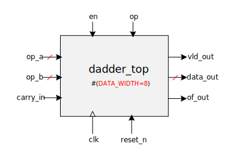
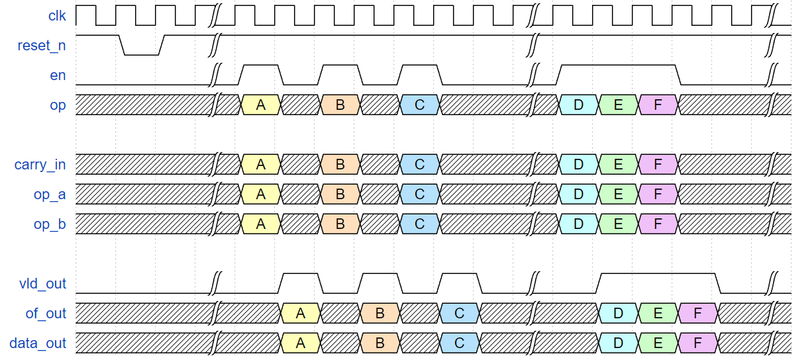

# Decimal Adder/Subtracter

This wonky and simplistic decimal full adder/subtracter takes in 2 operands and outputs an 'overflow' bit which doubles as a negative sign.
The entire design operates on 'decimal' data; that is, it does NOT use 1 or 2's complement.

It is controlled by:
- enabled (`en`)
- operation (`op`):
  - add : `1`
  - subtract : `0`
 

