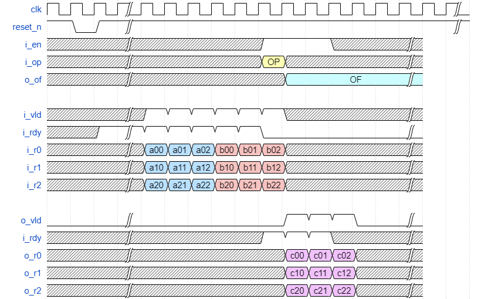

# Integer Matrix APU

 

This simplistic Matrix APU operates on integer 4x4 matrices loaded & output row-by-row.  Each member is an unsigned integer of
bit width controlled by the `DATA_WIDTH` parameter.  All operations take `4+4=8` cycles before the result matrix is output
row-by-row on the output data lines (`o_r0`-`o_r3`).

It is controlled by:
- enabled (`en`)
- operation (`op`):
  - ADD : `2'b0`
  - MULTIPLY : `2'b1`
