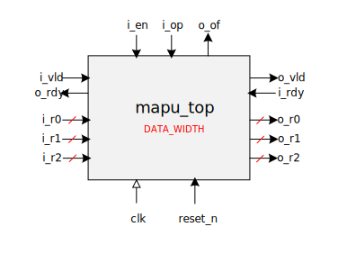

# Integer Matrix APU

This simplistic matrix APU operates on 4x4 matrices loaded & output row-by-row.  Each member is an unsigned integer of
bit width controlled by the `DATA_WIDTH` parameter.  All operations take `4+4+1=9` cycles before the result matrix is output
row-by-row on the output data lines (`o_r0`-`o_r3`).  The APU is ignorant of overflow conditions to simplify the
verification efforts.  This is a major flaw which emphasizes that this design is only for demonstration purposes.

It is controlled by:
- enabled (`en`)
- operation (`op`):
  - ADD : `2'b00`
  - SUBTRACT : `2'b01`
  - MULTIPLY : `2'b10`
  - RESERVED : `2'b11`
 

